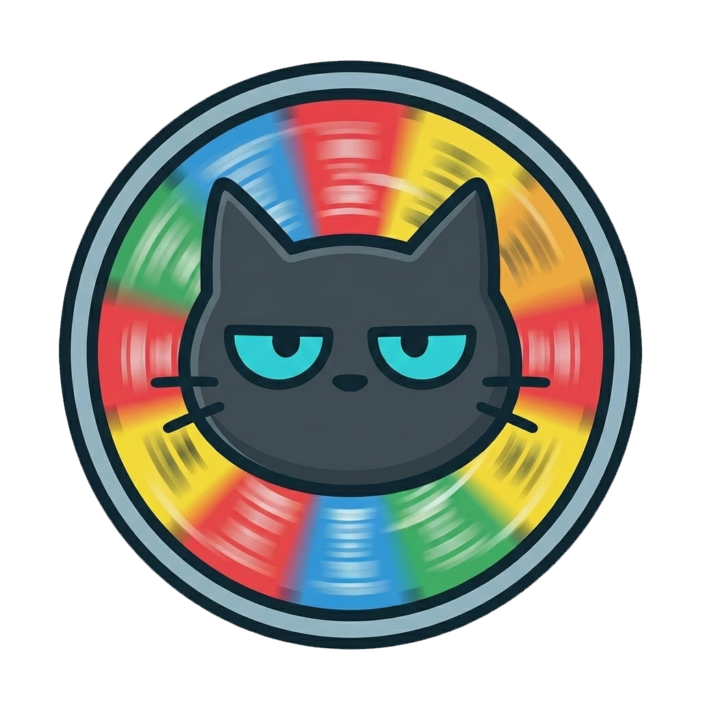

<div align="center">


# Night Cat Fate Flow

### 夜喵随机抽选器 | Night Cat Random Selector

✨ 一个优雅、有趣的现代化随机抽选工具，带有可爱的吉祥物和精美的视觉效果 ✨

*An elegant and fun modern random selection tool with a cute mascot and beautiful visual effects*

[](https://vuejs.org/)
[](https://www.typescriptlang.org/)
[](https://vitejs.dev/)
[](https://tailwindcss.com/)
[](LICENSE)

[🌐 在线演示 Live Demo](https://nightcatcoding.github.io/night_cat_fate_flow/) · [📖 文档 Docs](#快速开始-quick-start) · [🐛 反馈问题 Issues](https://github.com/nightcatcoding/night_cat_fate_flow/issues)

</div>

---

## 📌 项目简介 | Introduction

**Night Cat Fate Flow** 是一个基于 Vue 3 构建的现代化随机抽选 Web 应用，专为各种抽奖、点名、随机分配场景设计。

**Night Cat Fate Flow** is a modern random selection web application built with Vue 3, designed for various lottery,
roll call, and random assignment scenarios.

### 🎯 解决的问题 | Problems Solved

- **活动抽奖** - 年会、团建、课堂等场景的随机抽选需求
- **决策困难** - 选择困难症患者的福音，万物皆可抽
- **公平性保证** - Fisher-Yates 洗牌算法确保真正的随机性
- **数据管理** - 支持分类管理、Excel 导入导出，告别手工整理

---

## ✨ 核心功能 | Key Features

### 🎰 老虎机式抽选动画

流畅的滚动动画效果，营造紧张刺激的抽选氛围，支持自定义旋转时长（1-10秒）。

*Smooth slot machine animation creates an exciting selection atmosphere with customizable spin duration.*

### 🗂️ 多分类管理

创建多个独立清单（如：主菜、甜点、参与者），每个分类支持独立主题色（青色、蓝色、紫色、粉色、金色、绿色）。

*Create multiple independent lists with individual theme colors for each category.*

### 📊 Excel 智能导入导出

一键导入 Excel 名单，自动识别分类与颜色；支持导出抽选历史，便于存档。

*One-click Excel import with automatic category recognition; export draw history for archiving.*

### 🎊 彩花庆祝特效

中奖时自动触发 Canvas Confetti 彩花特效，单人中奖与多人中奖有不同庆祝效果。

*Automatic confetti celebration on winning with different effects for single vs. multiple winners.*

### 🐱 互动吉祥物

可爱的夜喵吉祥物根据不同状态（等待、旋转、中奖、空闲）展示不同表情与台词。

*Cute night cat mascot displays different expressions and dialogues based on current state.*

### 💾 本地数据持久化

基于 Pinia + localStorage 的状态管理，数据自动保存，关闭浏览器也不丢失。

*Data persistence with Pinia + localStorage, auto-save ensures no data loss.*

---

## 🛠️ 技术栈 | Tech Stack

| 类别 Category          | 技术 Technology                                |
|----------------------|----------------------------------------------|
| **框架 Framework**     | Vue 3.5 (Composition API + `<script setup>`) |
| **语言 Language**      | TypeScript 5.7                               |
| **构建工具 Build**       | Vite 6.0                                     |
| **样式 Styling**       | TailwindCSS 3.4 + PostCSS                    |
| **状态管理 State**       | Pinia 2 + pinia-plugin-persistedstate        |
| **路由 Routing**       | Vue Router 4                                 |
| **UI 组件 Components** | Headless UI + Lucide Icons                   |
| **工具库 Utilities**    | VueUse, SheetJS (xlsx), Canvas Confetti      |
| **部署 Deployment**    | GitHub Pages (gh-pages)                      |

---

## 📦 安装指南 | Installation

### 环境要求 | Prerequisites

- **Node.js** >= 18.0.0
- **npm** >= 9.0.0 或 **pnpm** >= 8.0.0
- 现代浏览器（Chrome, Firefox, Safari, Edge 最新版）

### 安装步骤 | Steps

```bash
# 1. 克隆仓库 | Clone the repository
git clone https://github.com/nightcatcoding/night_cat_fate_flow.git

# 2. 进入项目目录 | Navigate to project directory
cd night_cat_fate_flow

# 3. 安装依赖 | Install dependencies
npm install
# 或使用 pnpm | or use pnpm
pnpm install

# 4. 启动开发服务器 | Start dev server
npm run dev
```

浏览器会自动打开 `http://localhost:5173/night_cat_fate_flow/`

*Browser will auto-open at `http://localhost:5173/night_cat_fate_flow/`*

---

## 🚀 快速开始 | Quick Start

### 基本使用流程 | Basic Workflow

```
1. 创建清单分类 → 2. 添加候选项 → 3. 点击"开始抽选" → 4. 查看中奖结果 🎉
```

### 命令速查 | Command Reference

```bash
# 开发模式 | Development
npm run dev

# 生产构建 | Production build
npm run build

# 预览构建结果 | Preview build
npm run preview

# 部署到 GitHub Pages | Deploy to GitHub Pages
npm run deploy
```

---

## ⚙️ 配置说明 | Configuration

### 应用内设置 | In-App Settings

通过右上角 **设置按钮** 可调整以下配置：

| 设置项       | 说明           | 默认值  |
|-----------|--------------|------|
| **旋转时长**  | 老虎机动画持续时间    | 5 秒  |
| **彩花时长**  | 庆祝特效持续时间     | 5 秒  |
| **中奖后移除** | 中奖者是否自动标记为已选 | ✅ 开启 |
| **语言**    | 界面语言         | 中文   |

### 构建配置 | Build Configuration

项目使用 `vite.config.ts` 进行构建配置：

```typescript
// vite.config.ts 关键配置
export default defineConfig({
    base: '/night_cat_fate_flow/',  // GitHub Pages 部署路径
    build: {
        minify: 'esbuild',
        // 代码分割策略 | Code splitting
        rollupOptions: {
            output: {
                manualChunks: {
                    'vue-core': ['vue', 'vue-router'],
                    'state': ['pinia', 'pinia-plugin-persistedstate'],
                    'excel': ['xlsx'],
                    // ...
                }
            }
        }
    }
})
```

---

## 📁 项目结构 | Project Structure

```
night_cat_fate_flow/
├── 📁 public/                    # 静态资源 | Static assets
│   ├── night_cat_fate_flow_favicon.png
│   └── 404.html                  # GitHub Pages SPA fallback
│
├── 📁 src/
│   ├── 📁 assets/                # 图片资源 | Images
│   │   ├── pray.png              # 吉祥物图片 | Mascot image
│   │   └── main.css
│   │
│   ├── 📁 components/            # 组件库 | Components
│   │   ├── 📁 draw/              # 抽选相关组件
│   │   ├── 📁 history/           # 历史记录组件
│   │   ├── 📁 layout/            # 布局组件（Header, Modal, Drawer）
│   │   ├── 📁 mascot/            # 吉祥物组件
│   │   ├── 📁 setup/             # 配置页组件
│   │   ├── 📁 ui/                # 通用 UI 组件（Button, Card, Input...）
│   │   └── 📁 wheel/             # 老虎机/转盘组件
│   │
│   ├── 📁 composables/           # 组合式函数 | Composables
│   │   ├── useConfetti.ts        # 彩花特效
│   │   ├── useDraw.ts            # 抽选核心逻辑
│   │   ├── useExcel.ts           # Excel 导入导出
│   │   └── useMascotState.ts     # 吉祥物状态管理
│   │
│   ├── 📁 stores/                # Pinia 状态管理 | State stores
│   │   ├── gameStore.ts          # 游戏核心状态（分类、历史、设置）
│   │   └── uiStore.ts            # UI 状态（视图、Toast、Modal）
│   │
│   ├── 📁 types/                 # TypeScript 类型定义
│   │   └── index.ts
│   │
│   ├── 📁 views/                 # 页面视图 | Page views
│   │   ├── SetupView.vue         # 配置页
│   │   └── DrawView.vue          # 抽选页
│   │
│   ├── App.vue                   # 根组件
│   └── main.ts                   # 应用入口
│
├── 📄 package.json
├── 📄 vite.config.ts             # Vite 配置
├── 📄 tailwind.config.js         # TailwindCSS 配置
├── 📄 tsconfig.json              # TypeScript 配置
└── 📄 LICENSE                    # AGPL-3.0 开源协议
```

---

## 📄 开源协议 | License

本项目采用 **GNU Affero General Public License v3.0 (AGPL-3.0)** 开源协议。

This project is licensed under the **GNU Affero General Public License v3.0**.

详见 [LICENSE](LICENSE) 文件。

---

## 🤝 贡献指南 | Contributing

欢迎提交 Issue 和 Pull Request！

1. Fork 本仓库
2. 创建特性分支 (`git checkout -b feature/AmazingFeature`)
3. 提交更改 (`git commit -m 'Add some AmazingFeature'`)
4. 推送到分支 (`git push origin feature/AmazingFeature`)
5. 发起 Pull Request

---

<div align="center">

**如果这个项目对你有帮助，请给一个 ⭐ Star 支持一下！**

*If this project helps you, please give it a ⭐ Star!*

Made with ❤️ and ☕

</div>
